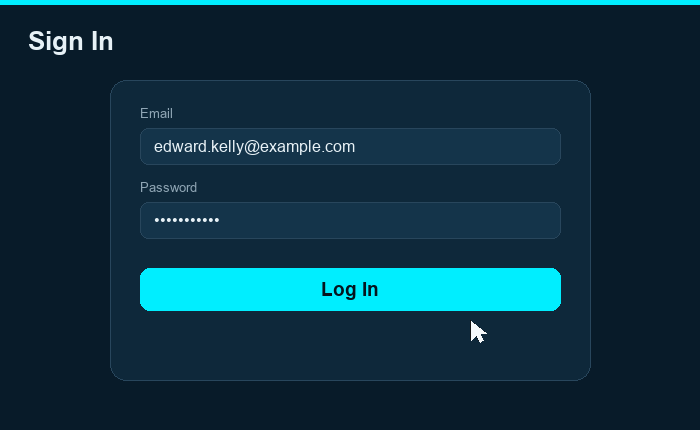
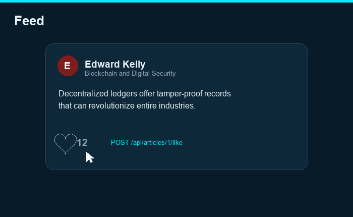
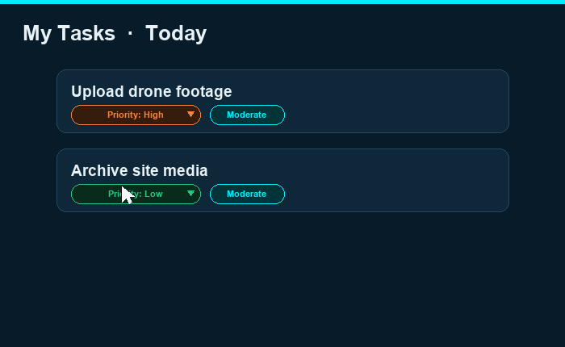
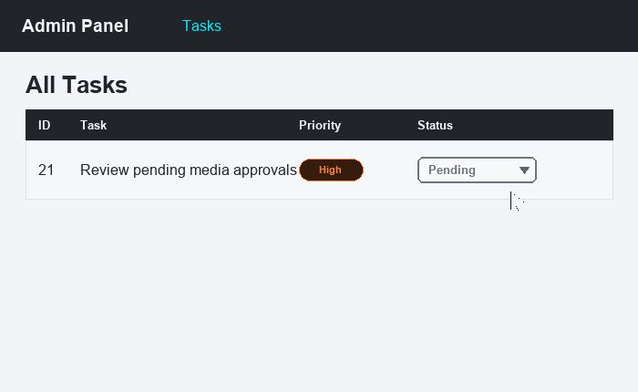

# Social Network

A full-stack social network application with article publishing, comments, likes, follows, direct messaging, per-user task lists, editable profiles, and an admin panel.

## Tech Stack

| Layer | Technology |
|-------|------------|
| **Frontend** | React 18, TypeScript, Vite, Tailwind CSS, React Router |
| **Backend** | PHP (built-in server), SQLite |
| **Auth (API)** | Bearer tokens (stored in DB, 24-hour lifetime) |
| **Auth (Admin)** | PHP sessions with CSRF protection |
| **Admin UI** | Bootstrap 5 + Bootstrap Icons |

---

## Project Structure

```
project/
├── backend/                  # PHP REST API + Admin panel
│   ├── index.php             # Main API router + all endpoint handlers
│   ├── auth.php              # Auth logic (signup, login, logout, token validation)
│   ├── db.php                # SQLite connection + auto-migration
│   ├── seed.php              # Seed script (demo users, articles, tasks)
│   ├── database.sqlite       # SQLite database (auto-created)
│   ├── uploads/              # Uploaded images (admin posts + user avatars)
│   └── admin/                # Admin panel (PHP + Bootstrap)
│       ├── login.php         # Admin login page
│       ├── logout.php        # Admin logout
│       ├── auth_check.php    # Session & CSRF helpers
│       ├── posts.php         # Article management (CRUD)
│       ├── comments.php      # Comment management
│       ├── tasks.php         # Task management (CRUD + inline status/priority)
│       └── templates/        # Shared header/footer
├── frontend/                 # React SPA
│   ├── public/               # Static assets (icons + downloadable manager files)
│   └── src/
│       ├── api/              # API client + auth/users/messenger/profile/tasks
│       ├── components/       # PostCard, forms, Menu (taskbar), SearchInput …
│       ├── context/          # AuthContext (global auth state)
│       ├── pages/            # Home, Article, Login, Profile, Search, Messenger, Settings, Tasks
│       ├── types/            # Shared TypeScript types (article, task)
│       ├── utils/            # mediaUrl, nickname validation helpers
│       └── CSS/              # Custom styles
├── docs/demos/               # Animated GIF walkthroughs of key features
├── core/                     # Legacy MySQL layer (not used by main app)
└── test/                     # Integration tests
    └── article-tests.mjs    # Article API test suite
```

---

## Installation & Launch

### Prerequisites

- **PHP 7.4+** with PDO SQLite extension
- **Node.js 16+** and npm (or pnpm)

### Step 1: Start the Backend

Open a terminal in the project root and run:

```bash
php -S localhost:8000 -t backend backend/index.php
```

> The trailing `backend/index.php` is the router script. It is required so the
> server can serve the built React app's static assets (`/assets/*.js`, `*.css`)
> from `frontend/dist`. Without it, requests for files with extensions return a
> bare 404 and the single-server / tunnel setup shows a blank page.

The database file (`backend/database.sqlite`) is created automatically on first request. All tables are migrated automatically via `db.php`.

### Step 2: Seed Demo Data (optional but recommended)

In a separate terminal:

```bash
php backend/seed.php
```

This creates **6 demo users**, **8 sample articles**, and **4 tasks per user** (24 tasks total). The seed is idempotent — re-running it skips data that already exists.

| User | Email | Password | Role |
|------|-------|----------|------|
| Edward Kelly | edward.kelly@example.com | password123 | user |
| Robert Tich | robert.tich@example.com | password123 | user |
| Franklin Strong | franklin.strong@example.com | password123 | user |
| Sophia Martinez | sophia.martinez@example.com | password123 | user |
| James Wilson | james.wilson@example.com | password123 | user |
| **Admin** | **admin@example.com** | **password123** | **admin** |

### Step 3: Start the Frontend

```bash
cd frontend
npm install
npm run dev
```

The frontend starts at **http://localhost:5173**. It talks to the backend at `http://localhost:8000` (override with the `VITE_API_URL` environment variable).

### Summary

| Service | URL |
|---------|-----|
| Frontend (React) | http://localhost:5173 |
| Backend API | http://localhost:8000 |
| Admin panel | http://localhost:8000/admin/login.php |

---

## Feature Walkthroughs

The `docs/demos/` folder contains short GIF recordings of the main flows:

| Flow | Demo |
|------|------|
| Log in |  |
| Like / unlike an article |  |
| Change a task's priority |  |
| Admin updates task status |  |

---

## How to Register

1. Open **http://localhost:5173** in your browser.
2. You will be redirected to the **Login** page (since you are not authenticated).
3. Click the **Sign Up** link at the bottom of the login form.
4. Fill in the registration form:
   - **Email** — must be a valid email format, unique across the system.
   - **Password** — minimum 8 characters, maximum 72 characters.
   - **Confirm Password** — must match the password field.
5. Click **Sign Up**.
6. On success, you are redirected to the **Login** page to sign in with your new account.

---

## How to Log In

1. Go to **http://localhost:5173/login**.
2. Enter your **email** and **password**.
3. Click **Log In**.
4. On success, you are redirected to the **Home** page (article feed).

Behind the scenes:
- The backend generates a random 64-character hex token, stores it in the database, and returns it to the frontend.
- The frontend saves the token in `localStorage` and attaches it as `Authorization: Bearer <token>` to every subsequent API request.
- Tokens expire after **24 hours**.
- Login is rate-limited: **5 attempts per IP address per 15 minutes**.

If you seeded the database, you can log in with any of the demo accounts (e.g., `edward.kelly@example.com` / `password123`).

---

## How to Create a Post (Article)

1. Log in and go to the **Home** page.
2. At the top of the feed, you will see the **Create Article** form with three fields:
   - **Title** (required) — the headline of your article.
   - **Body** (required) — the article content.
   - **Image URL** (optional) — a direct link to an image (must start with `http://` or `https://`).
3. Fill in the fields and click **Create**.
4. The new article appears at the top of the feed (articles are sorted newest-first).
5. Click on any article card to open its full page.

---

## How to Comment on a Post

1. Click on any article card in the feed to open the **Article Page**.
2. Scroll down to the **Comments** section.
3. Type your comment in the text area at the bottom.
4. Click **Send** (or the submit button).
5. Your comment appears immediately in the list below the article.

Each comment shows the author's name and creation date. Comments are loaded via `GET /api/articles/{id}/comments` and new ones are created via `POST /api/articles/{id}/comments`.

---

## How Likes Work

- Every article card on the Home page and the Article page has a **heart icon** (like button).
- Click the heart to **like** the article. The heart fills and the like count increments.
- Click it again to **unlike**. The heart unfills and the count decrements.
- Likes are a **toggle**: each `POST /api/articles/{id}/like` request checks if you already liked the article — if yes, it removes the like; if no, it adds one.
- The like count and your like status (`user_has_liked`) are included in every article response, so the UI always reflects the current state.
- Each user can like an article only once (enforced by a composite primary key on `user_id` + `article_id`).

---

## Finding People & Direct Messaging

The app supports a follow-based direct messaging system. There are two entry points:

### Search Friends (search tab)

1. Tap the **search** icon in the bottom navigation bar.
2. Type a **username** or a **numeric user ID** — matches are found by name, email, or exact ID.
3. Each result shows the person's name and ID. Click **Message** to open a private chat panel.
4. Type a message and send it. Because direct messages require a connection, messaging someone new automatically follows them first, then delivers the message.

### Messenger (message tab)

1. Tap the **message** icon in the bottom navigation bar.
2. Search for people and **Follow** / **Unfollow** them.
3. The left column lists everyone you follow along with the last message preview; select a conversation to open the thread.
4. You can send messages to anyone you follow. Messages are sanitized server-side and capped at 4000 characters.

**Messaging rules (server-enforced):**
- You can only send a message to someone you follow (`POST /api/messenger/messages`).
- You can view a thread if either side follows the other, or a message already exists between you (`GET /api/messenger/messages`).

---

## Tasks

Each user has a personal task list (seeded with construction-crew style assignments).

1. Open the **Profile** page and click **View my tasks** (route: `/tasks`).
2. Tasks are grouped into **Today** and **This Week** and sorted most-urgent-first.
3. Each task shows its **priority** (low / medium / high / critical), **complexity** (simple / moderate / complex), **status** (pending / in progress / done), and optional **due date**.
4. You can change a task's **priority** inline — updates are optimistic and saved via `PATCH /api/tasks/{id}`.
5. **Status** is managed by an administrator (see the Admin Panel). Regular users may only change priority on their own tasks.

---

## Editing Your Profile

On the **Profile** page you can:

- **Set a nickname** (display name) — letters, numbers, spaces, `_`, `-`, and `—` are allowed (max 50 chars). Leave it empty to clear. Saved via `PATCH /api/users/me`.
- **Upload an avatar** — JPEG, PNG, GIF, or WebP, up to 2 MB. Saved via `POST /api/users/me/avatar` and stored under `backend/uploads/`.
- **Remove your avatar** — via `DELETE /api/users/me/avatar`.
- **Browse your own posts** with pagination.

---

## Bottom Navigation (Taskbar)

The persistent bottom bar provides quick navigation and a download shortcut:

- **+** (center) — Home / article feed
- **Search** — Find friends and message them
- **Profile** — Your profile, posts, and the link to your tasks
- **Messenger** — Conversations with people you follow
- **Settings** — Settings page
- **Download** — A popover offering files from your manager: a blank **Excel (.xlsx)** and a blank **Word (.docx)** file (served from `frontend/public/`)

---

## Admin Panel

### Accessing the Admin Panel

1. Go to **http://localhost:8000/admin/login.php** in your browser.
2. Log in with an admin account. If you seeded the database:
   - **Email:** `admin@example.com`
   - **Password:** `password123`
3. After login, you are redirected to the **Posts** management page. The top navigation links to **Posts**, **Comments**, and **Tasks**.

### Post Management (posts.php)

The admin can perform full CRUD on articles:

- **View all posts** — a table listing every article with title, author, date, and action buttons.
- **Add a new post** — fill in title, body, and optionally upload an image file (JPEG, PNG, GIF, or WebP). Images are stored in `backend/uploads/`.
- **Edit a post** — change the title, body, or replace the image.
- **Delete a post** — removes the article and all its associated comments (cascade delete).

### Comment Management (comments.php)

- **View recent comments** — lists the latest comments with article title, author, body, and date.
- **Delete a comment** — remove any inappropriate or spam comment.

### Task Management (tasks.php)

- **View all tasks** across users.
- **Add / edit / delete** tasks (title, description, urgency, complexity, scope, status, due date, assigned user).
- **Inline quick-update** of a task's **priority** or **status** straight from the list.

### Security

- Admin pages are protected by PHP sessions. Only users with `role = 'admin'` can access them.
- All POST actions are protected by **CSRF tokens**.
- Image uploads are validated by MIME type (not just file extension).

---

## API Reference

All API responses follow this format:

```json
{
  "success": true,
  "data": { ... }
}
```

On error:

```json
{
  "success": false,
  "error": "Error message"
}
```

### Authentication

| Method | Endpoint | Auth | Description |
|--------|----------|------|-------------|
| POST | `/api/auth/signup` | No | Register a new user |
| POST | `/api/auth/login` | No | Log in, receive a token |
| POST | `/api/auth/logout` | Bearer | Invalidate the current token |
| GET | `/api/auth/me` | Bearer | Get current user info |

### Articles

| Method | Endpoint | Auth | Description |
|--------|----------|------|-------------|
| GET | `/api/articles?page=1` | Bearer | Paginated list (5 per page, newest first); add `&user_id={id}` to filter by author |
| GET | `/api/articles/{id}` | Bearer | Single article with like/comment counts |
| POST | `/api/articles` | Bearer | Create a new article |
| DELETE | `/api/articles/{id}` | Bearer | Delete your own article |

### Comments

| Method | Endpoint | Auth | Description |
|--------|----------|------|-------------|
| GET | `/api/articles/{id}/comments` | Bearer | List comments for an article |
| POST | `/api/articles/{id}/comments` | Bearer | Add a comment |
| DELETE | `/api/articles/{id}/comments/{comment_id}` | Bearer | Delete your own comment |

### Likes

| Method | Endpoint | Auth | Description |
|--------|----------|------|-------------|
| POST | `/api/articles/{id}/like` | Bearer | Toggle like (returns `{ liked, like_count }`) |

### Users, Follows & Profile

| Method | Endpoint | Auth | Description |
|--------|----------|------|-------------|
| GET | `/api/users` | Bearer | List all users |
| GET | `/api/users/search?q=&limit=` | Bearer | Search users by name, email, or numeric ID |
| POST | `/api/users/{id}/follow` | Bearer | Follow a user |
| DELETE | `/api/users/{id}/follow` | Bearer | Unfollow a user |
| PATCH | `/api/users/me` | Bearer | Update your nickname (display name) |
| POST | `/api/users/me/avatar` | Bearer | Upload an avatar (multipart, field `avatar`) |
| DELETE | `/api/users/me/avatar` | Bearer | Remove your avatar |

### Messenger

| Method | Endpoint | Auth | Description |
|--------|----------|------|-------------|
| GET | `/api/messenger/conversations` | Bearer | People you follow + last-message preview |
| GET | `/api/messenger/messages?user_id={id}` | Bearer | Messages in a thread |
| POST | `/api/messenger/messages` | Bearer | Send a message (`{ user_id, body }`) |

### Tasks

| Method | Endpoint | Auth | Description |
|--------|----------|------|-------------|
| GET | `/api/tasks?scope=day\|week` | Bearer | Your tasks (optional scope filter), urgency-sorted |
| PATCH | `/api/tasks/{id}` | Bearer | Update a task — users change `urgency`; admins may also change `status` |

---

## Database Schema

The SQLite database contains the following tables:

| Table | Purpose |
|-------|---------|
| `users` | User accounts (id, name, email, password hash, avatar_url, bio, **role**, created_at) |
| `tokens` | Active auth tokens (user_id, token, created_at) |
| `articles` | Published articles (user_id, title, body, image_url, created_at) |
| `comments` | Article comments (article_id, user_id, body, created_at) |
| `likes` | Article likes (user_id + article_id composite PK) |
| `messages` | Direct messages (sender_id, receiver_id, body, created_at) |
| `follows` | User follows (follower_id + followed_id composite PK) |
| `tasks` | Per-user tasks (user_id, title, description, urgency, complexity, scope, status, due_date, created_at) |
| `login_attempts` | Rate limiting (ip_address, attempted_at) |

The `users.name` and `users.role` columns are added via in-code migrations (`ALTER TABLE`) so existing databases upgrade automatically.

---

## Running Tests

With the backend running on port 8000:

```bash
node test/article-tests.mjs
```

The test suite covers:

1. **Article creation** — valid/invalid inputs, auth requirements
2. **User attribution** — author ownership, cross-user visibility
3. **Pagination** — page navigation, 5 items per page, edge cases
4. **Security** — no password/token leakage, SQL injection, XSS prevention

---

## Design & UI

- **Dark theme** with background color `#081b29` and cyan accent `#0ef`.
- **Bottom navigation bar** with Home, Search, Profile, Messenger, Settings, plus a Download shortcut. The Tasks screen is reached from the Profile page.
- **Responsive layout** with media queries for smaller screens.
- The **Home**, **Article**, **Profile**, **Search**, **Messenger**, and **Tasks** pages are connected to the API. The **Settings** page is still static/mock UI.

---

## Notes

- The `core/` directory contains a legacy MySQL database layer that is not used by the main application. The app runs entirely on SQLite.
- The frontend has a Google login button on the login page, but it is not functional (UI only).
- There is no logout button in the frontend UI, though the logout logic exists in `AuthContext`.
- The share button on article cards is visual only (not connected to any API).
- The Settings page is still UI-only and not wired to the backend.
```
